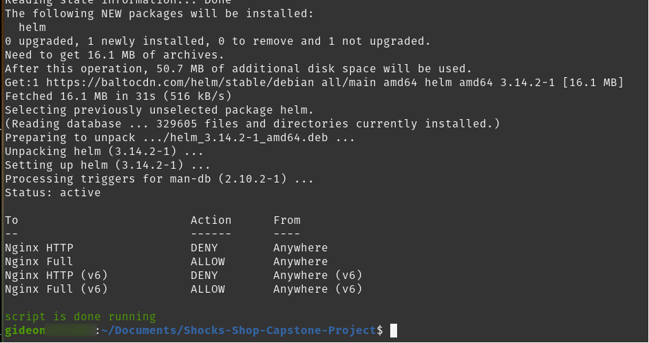
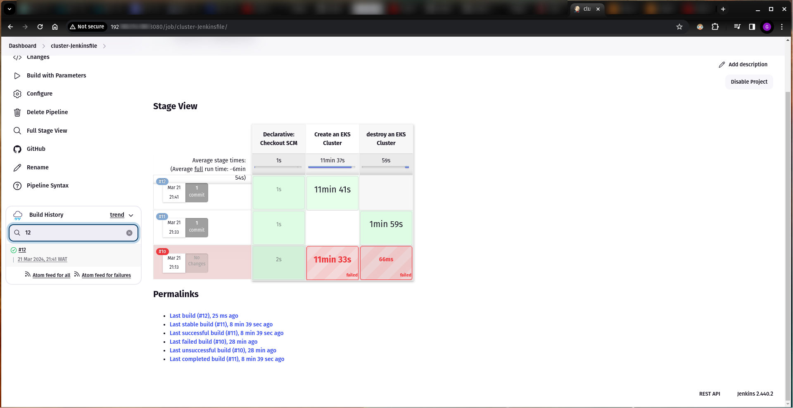

# AltSchool Capstone Project

## Overview
We will deploy the Socks Shop application as a reference for modern cloud-native technologies. Comprising various microservices and designed for high scalability, resilience, and fault tolerance, it's perfect for Kubernetes deployment.

The Socks Shop application is deployed on a Kubernetes cluster using Terraform, with a CI/CD pipeline using Jenkins, and monitoring application performance and health using Prometheus. I'll also use Helm for package management.

## How to Setup
- Clone the repo and change into the directory
- Make the `script.sh` file executable and run it to install Terraform, Kubectl, AWS CLI, Helm and Jenkins

- [Set up the AWS CLI](https://docs.aws.amazon.com/cli/latest/userguide/getting-started-quickstart.html#getting-started-quickstart-new-command), [Create/Add a User in Jenkins](https://www.guru99.com/create-users-manage-permissions.html), and [Set up Jenkins](https://www.digitalocean.com/community/tutorials/how-to-install-jenkins-on-ubuntu-22-04#:~:text=Step%204%20%E2%80%94%20Setting%20Up%20Jenkins)
- Setup the cluster-Jenkinsfile pipeline, use the `cluster-Jenkinsfile` file as the script and deploy your EKS Cluster

- Check to see if it has provisioned 

- Next, setup the application deployment pipeline using the `Jenkinsfile` file to deploy the application.

### Note
The domain registeration of the domain name is still in progress and I am currently in contact with the AWS support team to hasten the process as my account is currently under review before the domain is validated. Thank you!